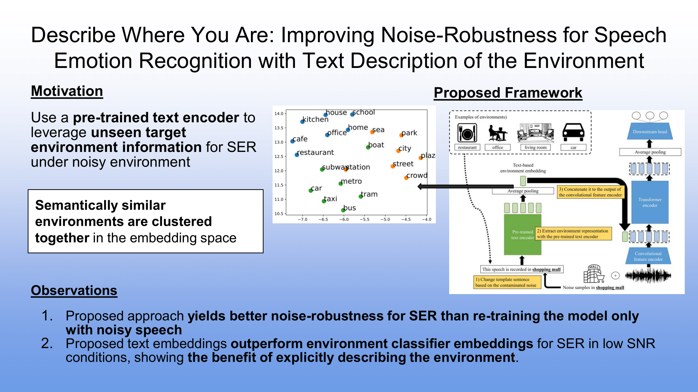

# Describe Where You Are: Improving Noise-Robustness for Speech Emotion Recognition with Text Description of the Environment


## Abstract
Speech emotion recognition (SER) systems often struggle in real-world environments, where ambient noise severely degrades their performance. This paper explores a novel approach that exploits prior knowledge of testing environments to maximize SER performance under noisy conditions. To address this task, we propose a text-guided, environment-aware training where an SER model is trained with contaminated speech samples and their paired noise description. We use a pre-trained text encoder to extract the text-based environment embedding and then fuse it to a transformer-based SER model during training and inference. We demonstrate the effectiveness of our approach through our experiment with the MSP-Podcast corpus and real-world additive noise samples collected from the Freesound and DEMAND repositories. Our experiment indicates that the text-based environment descriptions processed by a large language model (LLM) produce representations that improve the noise-robustness of the SER system. With a contrastive learning (CL)-based representation, our proposed method can be improved by jointly fine-tuning the text encoder with the emotion recognition model. Under the -5dB signal-to-noise ratio (SNR) level, fine-tuning the text encoder improves our CL-based representation method by 76.4% (arousal), 100.0% (dominance), and 27.7% (valence).
## Setup
```
conda env create -f tg_eat_env.yml
```
### Dataset Download
- MSP-Podcast v1.10: [link](https://www.lab-msp.com/MSP/MSP-Podcast.html)
- Noise samples from Freesound
    - Check filelists in `data/filelist/{train, dev, test}.txt
    - Download files from Freesound repository
## Data Preprocess
### Speech-Noise pair preparation
1. `preprocess/genreate_test_noise_pair.py`
- Change **noise_dir** to freesound-noise directory & **msp_path** to MSP-Pocast corpus directory
2. Run
```shell
bash python preprocess/generate_test_noise_pair.py unseen 0
```
### CLAP / BERT Embedding Extraction
- CLAP: `preprocess/get_clap_emb.py`
- BERT: `preprocess/get_bert_emb.py`

## Train
- Original SER model
```shell
python scripts/train/train_ser.py \
    --data_path=<MSP-Podcast corpus directory> \
    --seed=0 \
    --ssl_type=wavlm-base-plus \
    --batch_size=32 \
    --accumulation_steps=4 \
    --lr=1e-5 \
    --epochs=10 \
    --model_path=model/baseline || exit 0;
```

- TG-EAT-CL
* You need to train the original SER model before training TG-EAT-CL
```shell
python scripts/train/train_ser_with_noise_txt.py \
    --data_path=<MSP-Podcast corpus directory > \
    --seed=0 \
    --ssl_type=wavlm-base-plus \
    --batch_size=32 \
    --accumulation_steps=4 \
    --lr=1e-5 \
    --epochs=10 \
    --fuse_type=RT \
    --txt_type=clap \
    --original_model_path=model/baseline \
    --model_path=model/tg_eat_cl || exit 0;
```

- TG-EAT-LLM
* You need to train the original SER model before training TG-EAT-LLM
```shell
python scripts/train/train_ser_with_noise_txt.py \
    --data_path=<MSP-Podcast corpus directory > \
    --seed=0 \
    --ssl_type=wavlm-base-plus \
    --batch_size=32 \
    --accumulation_steps=4 \
    --lr=1e-5 \
    --epochs=10 \
    --fuse_type=RT \
    --txt_type=bert \
    --original_model_path=model/baseline \
    --model_path=model/tg_eat_llm || exit 0;
```

## Evaluation

```shell
python eval_ser_in_noise_with_text.py \
    --data_path=<noisy-version-of-MSP-Podcast-corpus> \
    --seed=0 \
    --ssl_type=wavlm-base-plus \
    --fuse_type=RT \
    --model_path=model/tg_eat_llm
```
